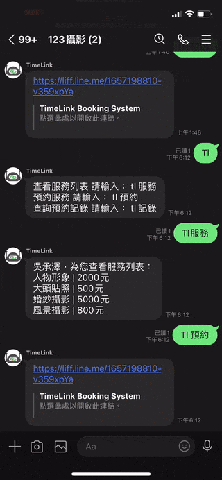

# TimeLink

TimeLine is a communication bridge between studios and customers.

Customers can view or reserve a service provided by the studio in the Line group through the TimeLink LINE Bot, and the studio can also manage the affairs in the Line group through the TimeLink management system. The system can manage the bot in multiple groups, and each bot can have different service information.

The system is divided into two parts:

-   <h3>TimeLink LINE Bot</h3>

    
    

-   <h3>TimeLink Management System</h3>

    

     

    

     

    

 

## Management System Site

[TimeLink](https://timelink.cc)

-   Test User for Login：
    -   Username: test
    -   Password: test

 

## EER diagram

 

## Technique

### Backend Architecture Diagram

-   Powered by <b>Flask</b>
-   Following <b>Factory pattern</b> for using different configuration for different web app environments.
-   Following the <b>MVC pattern</b>, the website is divided into three parts:
    -   Model: business logic and data access
    -   View: page and api response
    -   Controller: routing and integrate the model and view
-   Following <b>RESTful API</b> design pattern to provide a simple and clean API for the website.
-   Using <b>JWT</b> for authentication and authorization.
-   Using <b>Docker</b> for containerization, <b>Docker Compose</b> for deployment.
-   Using <b>Gunicorn</b> for Web Server Gateway Interface, <b>Nginx</b> for reverse proxy and SSL certificate.
-   Using <b>AWS EC2</b> for server, <b>RDS</b> (MySQL) for database, <b>S3</b> for storing image files and <b>CloudFront</b> for CDN.
-   Support <b>SSL</b> for HTTPS.
-   Using <b>Line Messaging API, SDK</b> on LINE Bot Server.
-   Using <b>Socket.IO</b> for real-time communication in Booking System.

### Frontend

-   CSS Framework: <b>TailwindCSS</b>
-   Using <b>LINE LIFF</b> for LINE app.
-   Support <b>RWD</b> for mobile devices.
