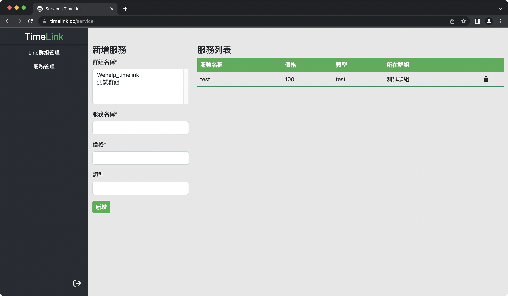
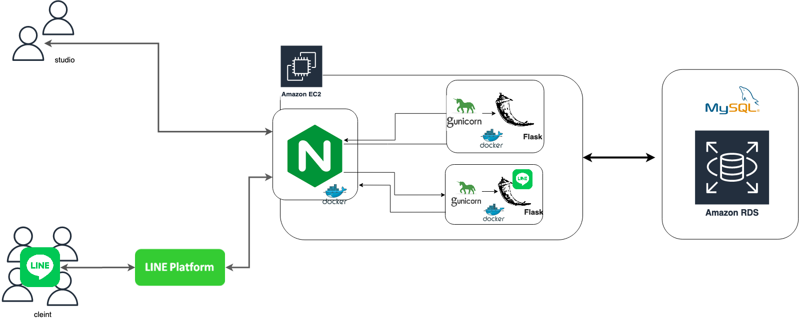

# TimeLink

為 Line 機器人預約系統，本系統分為兩部分:

TimeLink LINE Bot： LINE 客戶端在群組中，溝通之機器人

TimeLink 後台管理系統： 工作室端用以管理 LINE 群組之後台管理系統。

 

## Demo Link

---

### Line 群組

點此 [測試群組](https://line.me/ti/g/AkOrb1nN4N) 加入 Line 群組

或掃描 QRcode：

### TimeLink 管理系統

點此 [TimeLink 後台](https://timelink.cc) 連結

後台測試帳密：

-   username: test
-   password: test

 

## Technique

---

### Language

-   Python
    -   flask
    -   LINE Messaging API
-   HTML, CSS, JavaScript
    -   AJAX
    -   bootstrap 5

### Backend Architecture

-   使用 Docker, Docker-Compose 快速部署上 AWS Ec2
-   使用 Nginx 做反向代理
-   支援 HTTPS
-   使用 Gunicorn 作為 Flask 的 Web Server Gateway Interface
-   使用 AWS RDS 雲端 MySql 資料庫
